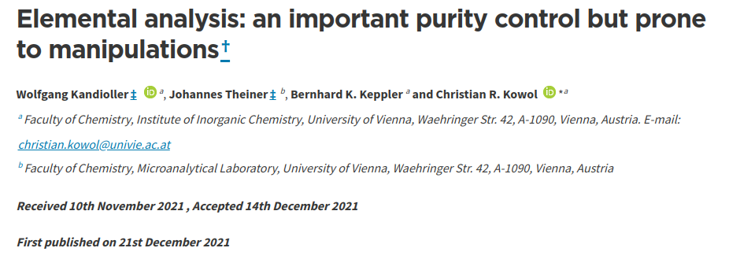

```{r setup, include=FALSE}
knitr::opts_chunk$set(echo = FALSE)
```

# iRODS + R

## Introduction to R

```{r users, echo=FALSE, message=FALSE}
library(rvest)
library(readr)

# number of packages
xc <- read_html("https://www.rdocumentation.org/") |> 
  html_nodes(".text-xl") 
n_pkg <- html_text(xc[2]) |> 
  parse_number()
```

 - Declarative programming centered around functions and logic (OOP capable)
 - Emphasis on statistics and visualization of data
 - Used by researchers and business
 - Open sourced, active useRs community (`r sprintf("%1.0f", n_pkg) ` packages)
 
<div class="centered"> 

```{r kdnuggest, options, echo=FALSE, warning=FALSE, message=FALSE, fig.height=3, fig.width=7}
# https://www.kdnuggets.com/2019/05/poll-top-data-science-machine-learning-platforms.html
library(ggplot2)
library(tidyr)
library(dplyr)
theme_set(theme_classic(base_size = 12))
theme_update(
  panel.background = element_rect(fill = "transparent", colour = NA),
  plot.background = element_rect(fill = "transparent", colour = NA)
)
knitr::opts_chunk$set(dev.args = list(bg = "transparent"))
# xc <- clipr::read_clip_tbl(header = FALSE) 
# colnames(xc) <- c("Platform", "2019% share", "2018% share", "% change")
# saveRDS(xc, "popR.rds")
popR <- readRDS("popR.rds") 
popR |> 
  select(-`% change`) |> 
  pivot_longer(-Platform) |> 
  mutate(value = readr::parse_number(value)) |> 
  drop_na() |> 
  ggplot(aes(y = reorder(Platform, value), x = value, fill = name)) +
    geom_bar(stat = "identity", position = "dodge", orientation = "y") +
    labs(fill = "", x = "", y = "")
``` 

</div>

<div style="text-align:center">
  <font size="2.5">
  <a href="https://www.kdnuggets.com">kdnuggets.com</a>
  </font>
</div>

## Why iRODS?

<!-- the individual -->

  - R very powerful for creating reproducible workflows
    - scripted analysis
    - markdown ("Rmarkdown" + the new kid "Quarto")

*Never again wonder what method did I use to center variable "foo" in my regression model ... ?*

  - But what about the data itself?
    - SQLite, MySQL, PostgreSQL, MonetDB with `DBI` package and ODBC drivers
    - iRODS?

## Opening-up the black box with iRODS + R

<!-- in a larger scope -->

  - Store unprocessed data
  - Share data and scripts with collaborators
  - Reviewer trace back the origin of data and imposed manipulations
  - Publish everything = open science


<div class="centered">
  {width=90%}
</div>

<div class="notes">
  add 1: Why rely solely on the manufacturers data handling and quality checks. Of course this does not mean that we should now all distrust the manufacturers but it would sometime be good to let a fresh mind have a look at how data is handled.
  add 2: Sometimes also reviewer want (or should) check the final to-be published results, and then we need easy access to the original data
</div>


## Is more data better?

- New innovations
- Inclusive science
- More transparent science (proof of final published values)


<div class="centered">
  
</div>

<div style="text-align:center">
  <font size="2.5">
  <a href="https://xkcd.com/2582/">xkcd.com</a>
  </font>
</div>


<div class="notes">
  The "vendor lock-in" results in situations where we don't actually know how we get to the values that we use in our research.
  
</div>


## {data-background=figures/integrated-lab.png}

# Design

## Design


  - Authentication
    + connect with iRODS server 
    + authenticate
  
  
</br>
</br>

```{r, eval = FALSE, echo=TRUE} 
# configuration file
create_irods("<host>", "<zone>")
# authenticate
iauth()
```

## Design

  - Navigation
    + icommand like

</br>
</br>    
    
```{r, eval = FALSE, echo=TRUE} 
# current working collection
ipwd()
# change working collection
icd()
# list
ils()
```

## Design

  - Objects/files
    + icommand like

</br>
</br>

```{r, eval = FALSE, echo=TRUE}
foo <- 1:10
# configuration file
iput(foo)
# authenticate
iget("foo")
```
  
<div class="notes">
  - Configured for users only
  - Mapping of function to REST endpoints
  - native iRODS authentication (time based invalidation) = authenticate for every R session (restart)
  - No hardcoding need for secrets
  - configuration file to be create at the user or project level
  -   
  
</div>


# Implementation

## Implementation

```{r label, options}
pkgs <- c("curl", "httr2", "httptest2", "jsonlite")
knitr::write_bib(pkgs, "packages.bib", prefix = "")
```

- Curl in R
  + R interface to libcurl *curl* [@curl]
  + Wrapper *httr2* [@httr2] for *curl* and *jsonlite* [@jsonlite]

- Testing
  + irods demo server `docker-compose up -d nginx-reverse-proxy`
  + Testing with mocking *httptest2*  [@httptest2]
  + Automatic updates of snapshots with GitHub actions
  + `R CMD check` without internet (simulate CRAN checks)

## Roadmap

- submission to CRAN
- official release at UGM
- datamanager + panacaea packages

## FAIReLABS

**Help us!**
https://fairelabs.github.io/webpage/

<iframe src="https://fairelabs.github.io/webpage/" scrolling="yes"></iframe>


